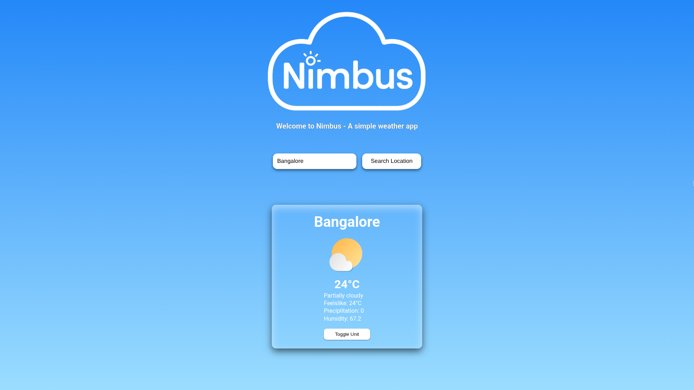
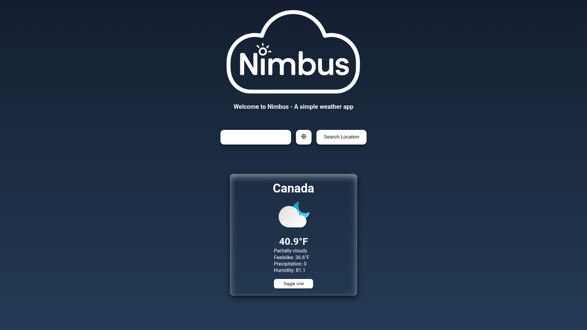

# 🌤️ Nimbus – A Simple Weather App

Nimbus is a lightweight weather application built with **vanilla JavaScript**, **HTML**, and **CSS**.  
It fetches real-time weather data using the [Visual Crossing Weather API](https://www.visualcrossing.com/), and displays temperature, humidity, conditions, and more — all wrapped in a clean, minimal UI.

---

## 🚀 Features

- 🔍 Search weather by city name
- 🌡️ Toggle between **Celsius** and **Fahrenheit**
- 🎨 Dynamic background and icons that change based on weather conditions

---

## 🧩 Built With

- **HTML5** – Markup structure
- **CSS3** – Layout and styling
- **JavaScript (ES6+)** – App logic
- **Visual Crossing Weather API** – Weather data provider

## 🧠 Learning Focus

- Modular JavaScript architecture (`import` / `export`)
- Working with APIs and asynchronous code (`fetch`, `async`/`await`)
- DOM manipulation and dynamic rendering
- Clean and maintainable code structure

## Screenshots

